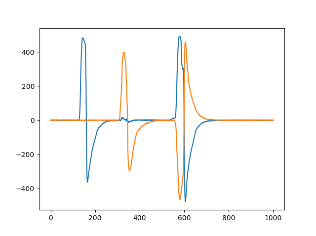
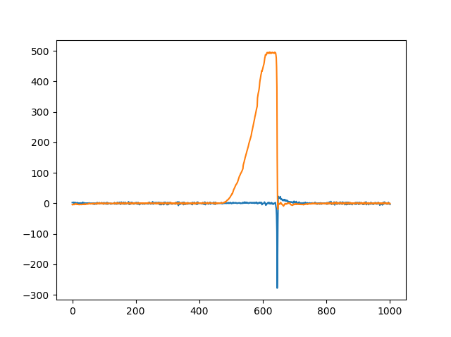

# ODrive Tool

The ODrive Tool is the accompanying PC program for the ODrive. It's main purpose is to provide an interactive shell to control the device manually, as well as some supporting functions like firmware update.

### Table of contents
<!-- TOC depthFrom:2 depthTo:2 -->

- [Installation](#installation)
- [Multiple ODrives](#multiple-odrives)
- [Configuration Backup](#configuration-backup)
- [Device Firmware Update](#device-firmware-update)
- [Flashing with an STLink](#flashing-with-an-stlink)
- [Liveplotter](#liveplotter)

<!-- /TOC -->

## Installation

Refer to the [Getting Started guide](getting-started#downloading-and-installing-tools).

Type `odrivetool --help` to see what features are available.

## Multiple ODrives

By default, `odrivetool` will connect to any ODrive it finds. If this is not what you want, you can select a specific ODrive.

To find the serial number of your ODrive, run `odrivetool`, connect exactly one ODrive and power it up. You should see this:
```
Connected to ODrive 306A396A3235 as odrv0
In [1]:
```
`306A396A3235` is the serial number of this particular ODrive. If you want ODrive Tool to ignore all other devices you would close it and then run `odrivetool --serial-number 306A396A3235`.

<details><summary markdown="span">My ODrive is stuck in DFU mode, can I still find the serial number?</summary><div markdown="block">
Yes, the serial number is part of the USB descriptors.

In Linux you can find it by running:
```
$ (sudo lsusb -d 1209:0d32 -v; sudo lsusb -d 0483:df11 -v) 2>/dev/null | grep iSerial
  iSerial                 3 385F324D3037
  iSerial                 3 306A396A3235
```
Here, two ODrives are connected.
</div></details>

## Configuration Backup

You can use ODrive Tool to back up and restore device configurations or transfer the configuration of one ODrive to another one.

 * To save the configuration to a file on the PC, run `odrivetool backup-config my_config.json`.
 * To restore the configuration form such a file, run `odrivetool restore-config my_config.json`.

## Device Firmware Update

<div class="note" markdown="span">__ODrive v3.4 or earlier__: DFU is not supported on these devices. You need to [flash with the external programmer](#flashing-with-an-stlink) instead.</div>

To update the ODrive to the newest firmware release, simply open up a terminal and run the following command:

```
~ $ odrivetool dfu
ODrive control utility v0.3.7.dev
Waiting for ODrive...
Found ODrive 308039673235 (v3.5-24V) with firmware v0.3.7-dev
Checking online for newest firmware... found v0.3.7
Downloading firmware...
Putting device 308039673235 into DFU mode...
Erasing... done            
Flashing... done            
Verifying... done            
```

Note that this command will connect to GitHub servers to retrieve the latest firmware.

If you have a non-default configuration saved on the device, ODrive Tool will try to carry over the configuration across the firmware update. If any of the settings are removed or renamed, you will get warning messages.

<details><summary markdown="span">How to flash a custom firmware</summary><div markdown="block">
If you want to flash a specific firmware file instead of automatically downloading one, you can run `odrivetool dfu path/to/firmware/file.hex`

You can download one of the officially released firmware files from [here](https://github.com/madcowswe/ODrive/releases). You will need one of the __.hex__ files (not the __.elf__ file). Make sure you select the file that matches your board version.

To compile firmware from source, refer to the [developer guide](developer-guide).
</div></details>


### Troubleshooting

* __Windows__: During the update, a new device called "STM32 BOOTLOADER" will appear. Open the [Zadig utility](http://zadig.akeo.ie/) and set the driver for "STM32 BOOTLOADER" to libusb-win32. After that the firmware update will continue.
* On some machines you will need to unplug and plug back in the USB cable to make the PC understand that we switched from regular mode to bootloader mode.
* If the DFU script can't find the device, try forcing it into DFU mode.

  <details><summary markdown="span">How to force DFU mode (ODrive v3.5)</summary><div markdown="block">
  Flick the DIP switch that "DFU, RUN" to "DFU" and power cycle the board. After you're done, put the switch back into the "RUN" position and power cycle the board again.
  </div></details>

  <details><summary markdown="span">How to force DFU mode (ODrive v3.1, v3.2)</summary><div markdown="block">
  Connect the pin "BOOT0" to "3.3V" and power cycle the board. If that alone doesn't work, also connect the pin "GPIO1" to "GND". After you're done, remove the wires and power cycle the board again.
  </div></details>

### Upgrading firmware with a different DFU tool
Some people have had issues using the python dfu tool, so below is a guide on how to manually use a different tool.

Before starting the below steps, you need to get firmware binary. You can download one of the officially released firmware files from [here](https://github.com/madcowswe/ODrive/releases). Make sure you select the file that matches your board version, and that you get the __.hex__ file (not the __.elf__ file).

To compile firmware from source, refer to the [developer guide](developer-guide).

#### Windows
You can use the DfuSe app from ST.

1. Download the tool [here](https://www.st.com/en/development-tools/stsw-stm32080.html). Unfortunately they make you create a login to download. Sorry about that.
1. After installing the tool, launch `DfuFileMgr.exe` which probably got added to the start menu as "Dfu file manager".
1. Select "I want to GENERATE a DFU file from S19, HEX or BIN files", press OK.
1. Click the button that says "S19 or Hex...", find the `ODriveFirmware.hex` file you built or downloaded.
1. Leave all the other settings as default and click the "Generate..." button.
1. Save the output file as `ODriveFirmware.dfu`. Note that the success message has a warning sign for some reason...
1. Launch `DfuSeDemo.exe` which probably got added to the start menu as "DfuSeDemo".
1. Force the ODrive into DFU mode, as per the instructions above "How to force DFU mode".
1. In the top left it should now be connected to "STM Device in DFU Mode".
   1. If it doesn't appear, it may be because the driver is set to libusb by Zadig. We need to set it back to the original driver. Follow [these instructions](https://github.com/pbatard/libwdi/wiki/FAQ#Help_Zadig_replaced_the_driver_for_the_wrong_device_How_do_I_restore_it).
1. In the bottom right section called "Upgrade or Verify Action" click the button "Choose...".
1. Locate the `ODriveFirmware.dfu` we made before.
1. Click button "Upgrade".
1. If you get a warning that it's not possible to check that it's the correct device type: click yes to continue.
1. Congratulations your ODrive should now be flashed; you can now quit DfuSeDemo.
1. Turn off the power to the ODrive and set the DIP switch back to RUN mode.

#### Linux
Install `dfu-util`:
```text
sudo apt install dfu-util
```

Force DFU mode, as per the instructions above.
In the Firmware directory, after finishing building the firmware:
```text
sudo dfu-util -a 0 -s 0x08000000 -D build/ODriveFirmware.bin
```

#### MacOS
**This section needs more detail. Please consider adding detail if you got it to work.**
You may be able to use [dfu-util](http://dfu-util.sourceforge.net/) to upgrade the firmware. The command should be similar to the Linux instructions.

## Flashing with an STLink

This procedure is only necessary for ODrive v3.4 or earlier. You will need an STLink/v2 or compatible programmer. You should have received one with your ODrive.

1. Install OpenOCD
   * **Windows:** [instructions](http://gnuarmeclipse.github.io/openocd/install/) (also follow the instructions on the ST-LINK/V2 drivers)
   * **Linux:** `sudo apt-get install openocd`
   * **macOS:** `brew install openocd`
2. Download the latest firmware release form [here](https://github.com/madcowswe/ODrive/releases). You will need the __.elf__ file. Make sure you select the file that matches your board version.
3. Wire up the ODrive and STLink/v2 programmer as shown in this picture:<br>
     
     Power up the ODrive.
4. Open up a terminal and navigate to the directory where the firmware is.
5. Run the following command (replace `ODriveFirmware_v3.4-24V.elf` with the name of your firmware file):
```
openocd -f interface/stlink-v2.cfg -f target/stm32f4x.cfg -c init -c "reset halt" -c "flash write_image erase ODriveFirmware_v3.4-24V.elf" -c "reset run" -c exit
```

If everything worked correctly, you should see something similar to this towards the end of the printout:
```
wrote 262144 bytes from file ODriveFirmware_v3.4-24V.elf in 10.194110s (25.113 KiB/s)
```

If something doesn't work, make sure `openocd` is in your `PATH` variable, check that the wires are connected properly and try with elevated privileges.

## Liveplotter

Liveplotter is used for the graphical plotting of odrive parameters (i.e. position) in real time. To start liveplotter, close any other instances of liveplotter and run `odrivetool liveplotter` from a new anaconda prompt window. By defult two parameters are plotted on startup; the encoder positon of axis 1 and axis 2. In the below example the motors are running in `closed_loop_control` while they are being forced off position by hand.



To change what parameters are plotted open odrivetool (located in Anaconda3\Scripts or ODrive-master\tools) with a text editor and modify the liveplotter function:
```
        # If you want to plot different values, change them here.
        # You can plot any number of values concurrently.
        cancellation_token = start_liveplotter(lambda: [
            my_odrive.axis0.encoder.pos_estimate,
            my_odrive.axis1.encoder.pos_estimate,
        ])
```
For example, to plot the approximate motor torque [N.cm] and the velocity [RPM] of axis1 with a 150KV motor and an 8192 count per rotation econder you would modify the function to read:
```
        # If you want to plot different values, change them here.
        # You can plot any number of values concurrently.
        cancellation_token = start_liveplotter(lambda: [
            (((my_odrive.axis0.encoder.pll_vel)/8192)*60), # 8192 CPR encoder
            ((8.27*my_odrive.axis0.motor.current_control.Iq_setpoint/150) * 100), # Torque [N.cm] = (8.27 * Current [A] / KV) * 100
        ])
```
In the example below the motor is forced off axis by hand and held there. In response the motor controller increases the torque (orange line) to counteract this disturbance up to a peak of 500 N.cm at which point the motor current limit is reached. When the motor is released it returns back to its commanded position very quickly as can be seen by the spike in the motor velocity (blue line).



To change the scale and sample rate of the plot modify the following parameters located at the beginning of utils.py (located in Anaconda3\Lib\site-packages\odrive):

```
data_rate = 100
plot_rate = 10
num_samples = 1000
```

For more examples on how to interact with the plotting functinality refer to the [Matplotlib examples.](https://matplotlib.org/examples)

### Liveplotter from interactive odrivetool instance
You can also run `start_liveplotter(...)` directly from the interactive odrivetool prompt. This is useful if you want to issue commands or otherwise keep interacting with the odrive while plotting.

For example you can type the following directly into the interactive prompt: `start_liveplotter(lambda: [odrv0.axis0.encoder.pos_estimate])`. Just like the examples above, you can list several parameters to plot separated by comma in the square brackets.
In general, you can plot any variable that you are able to read like normal in odrivetool.

